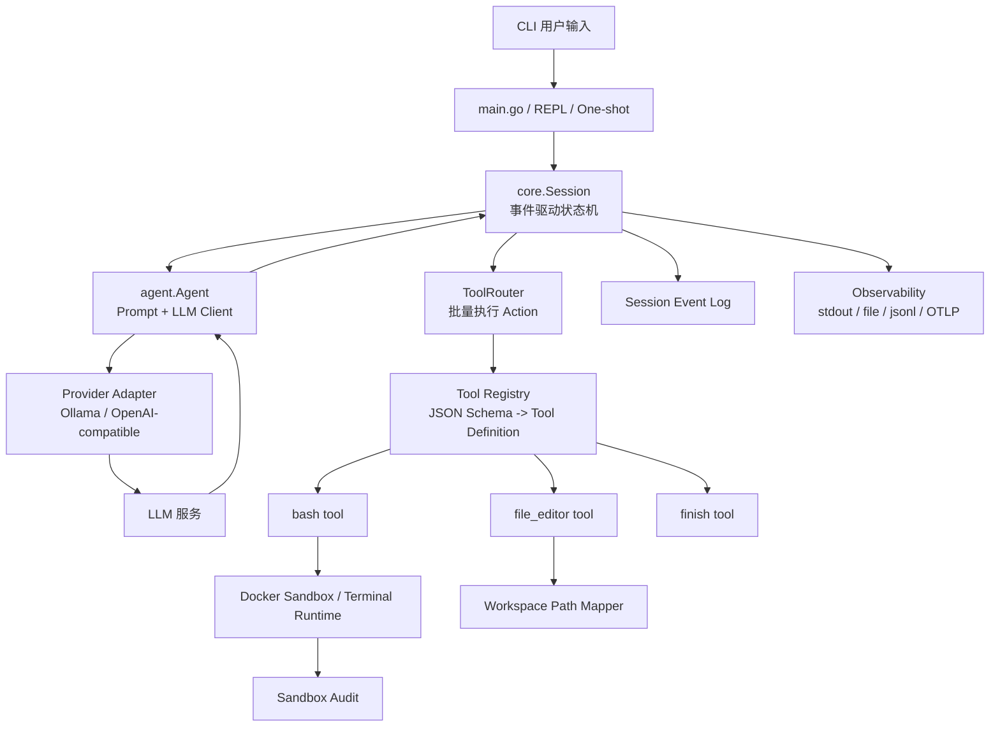
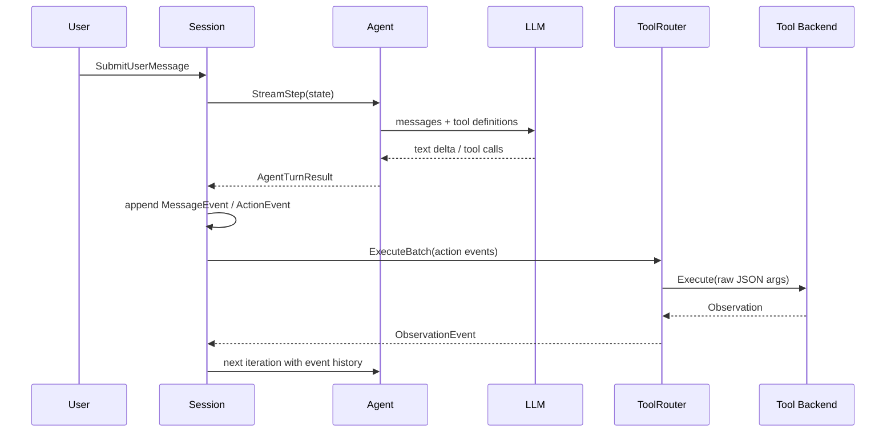

# OpenTalon

OpenTalon 是一个基于 Go 实现的本地 CLI Coding Agent Runtime。项目目标不是封装一个简单的 LLM + Tool demo，而是验证一个面向真实开发任务的 Agent 执行系统：模型可以在多轮循环中规划动作、调用本地工具、接收 observation，并在可观测和可约束的边界内继续执行。

当前实现重点放在五类问题：

- 多轮 Action-Observation Loop 的状态推进
- Tool Registry、JSON Schema 参数定义和 OpenAI-compatible tool calling 适配
- Bash、文件编辑、finish 等开发工具的统一执行协议
- Docker sandbox、路径映射、输出截断和执行审计
- Provider 抽象、流式输出、payload tracing 与敏感信息脱敏

## 架构图



## 核心模块

| 模块 | 路径 | 职责 |
| --- | --- | --- |
| CLI 入口 | `main.go` | 支持 one-shot 与交互式 REPL，初始化配置、日志、observability 和会话 |
| 会话状态机 | `internal/core` | 维护 session 状态、事件历史、迭代次数、流式回调和 action 执行调度 |
| Agent 抽象 | `internal/agent` | 构造 prompt，调用模型，解析流式响应和 tool calls |
| Provider 适配 | `internal/agent/llm_client_*.go` | 统一 Ollama 原生接口与 OpenAI-compatible `/chat/completions` 协议 |
| 工具体系 | `internal/tool` | 通过 Tool Registry 注册工具，基于结构体自动生成 JSON Schema |
| 文件编辑工具 | `internal/tool/file_editor` | 支持 view、create、str_replace、insert、undo_edit 等文件操作 |
| 终端工具 | `internal/tool/terminal` | 抽象 terminal backend，统一命令执行结果和错误语义 |
| Sandbox | `internal/sandbox` | Docker 容器生命周期、命令执行、超时、输出截断、只读挂载校验和审计 |
| 可观测性 | `pkg/observability` | 记录 LLM、工具、sandbox 的 span、payload 摘要、脱敏结果和导出数据 |
| 配置 | `pkg/config` | 从 `.env` 加载模型、日志和 prompt 配置 |

## 运行示例

### 1. 准备配置

```bash
cp .env.example .env
```

默认配置使用 Ollama：

```env
LLM_PROVIDER=ollama
LLM_MODEL=qwen3:32b
LLM_ENDPOINT=http://localhost:11434
LLM_API_KEY=
```

如果使用 OpenAI-compatible 服务，可调整为：

```env
LLM_PROVIDER=openai
LLM_MODEL=your-model
LLM_ENDPOINT=https://your-provider.example.com/v1
LLM_API_KEY=your-api-key
```

### 2. 交互式运行

```bash
go run .
```

示例输入：

```text
帮我查看当前目录有哪些 Go 文件，并总结主要模块
```

### 3. 单次任务运行

```bash
go run . "查看 internal/tool 目录下有哪些工具，并说明它们的作用"
```

### 4. 运行测试

```bash
go test ./...
```

涉及 Docker sandbox 的测试或本地执行需要本机安装 Docker，并准备 `opentalon/sandbox:dev` 镜像；如果没有 Docker，相关路径会返回稳定错误，但不代表 Agent 主循环不可运行。

## 配置说明

| 变量 | 默认值 | 说明 |
| --- | --- | --- |
| `DEBUG` | `false` | 是否开启调试模式 |
| `ONLY_ONE_LOG_FILE` | `false` | 是否合并日志输出 |
| `LOG_DIR` | `./logs` | session、日志等本地文件输出目录 |
| `LLM_PROVIDER` | `ollama` | 模型供应商，当前支持 `ollama` 与 OpenAI-compatible |
| `LLM_MODEL` | `qwen3:32b` | 模型名称 |
| `LLM_ENDPOINT` | `http://localhost:11434` | 模型服务地址 |
| `LLM_API_KEY` | 空 | OpenAI-compatible 服务鉴权 |
| `LLM_PROMPTS_DIR` | 空 | 自定义 prompt 目录 |
| `OBS_ENABLED` | `false` | 是否启用 observability |
| `OBS_EXPORTERS` | `stdout` | trace 导出方式，支持 stdout、file、jsonl、otlp 等实现 |
| `OBS_TRACE_DIR` | `.opentalon/traces` | trace 文件输出目录 |
| `OBS_PAYLOAD_SIZE_LIMIT` | `4096` | payload 摘要大小限制 |
| `OBS_PAYLOAD_PREVIEW_LIMIT` | `512` | payload 预览长度限制 |

## 工具调用流程



## 设计取舍

### 不依赖 LangChain 等现成框架

项目选择直接实现 Agent loop、事件模型、工具协议和 provider adapter。好处是可以精确控制每一轮状态、工具结果、错误语义和 tracing 数据；代价是需要自己维护协议兼容和边界条件。

### 事件驱动状态，而不是只拼接对话文本

Session 内部以 `MessageEvent`、`ActionEvent`、`ObservationEvent` 记录执行历史。这样可以区分用户消息、模型动作、工具结果和结束信号，也方便后续做持久化、回放、审计和恢复。

### 工具通过结构体生成 JSON Schema

工具实现只需要声明参数结构体和执行器，系统通过 `jsonschema` 自动生成 OpenAI-compatible tool definition。这样可以降低新增工具时对核心执行引擎的侵入。

### Bash 默认走 sandbox 路由

命令执行是 Coding Agent 风险最高的部分。当前实现提供 Docker sandbox 抽象、容器工作目录、只读挂载校验、执行超时、输出截断、路径映射和审计记录。当前边界仍然偏本地开发验证，不能直接等同于生产级安全隔离。

### Provider 层统一流式响应和 tool calling

Ollama 与 OpenAI-compatible 服务的 wire 协议不同，但上层 Agent 面向统一的 message、tool call 和 streaming delta。这样可以减少模型切换对核心流程的影响。

### Observability 只记录摘要，不保留无限 payload

LLM 请求、工具输入和 sandbox 输出可能包含敏感内容或大 payload。项目在 observability 层做 payload 大小限制、预览、哈希和脱敏，优先保证排障可用性，同时避免日志无限膨胀和敏感字段直接落盘。

## 当前边界

- 已实现 CLI 运行、Agent 主循环、工具注册、bash/file editor/finish 工具、多 provider 适配、Docker sandbox 抽象和 observability。
- Sandbox 适合本地开发和项目演示，仍需要进一步补齐权限审批、资源隔离策略、镜像构建规范和更完整的恢复机制。
- 当前重点是 Runtime 工程骨架，不包含复杂任务规划算法、多 Agent 协作或长期记忆系统。
